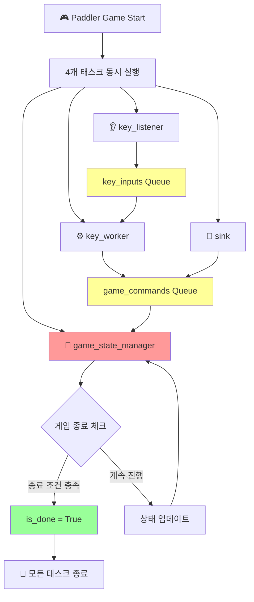

# 🚤 Paddler Game

비동기 프로그래밍을 활용한 실시간 패들링 게임입니다. 키보드 입력으로 배를 조종하며 목표 지점에 도달하는 것이 목표입니다!

## 🎮 게임 소개

물이 차오르는 배에서 노를 저어 목표 지점에 도달해야 하는 스릴 넘치는 게임입니다. 
- **노 젓기**: `d`, `s`, `a` 키를 모두 눌러 배를 전진시키세요
- **물 퍼내기**: `i`, `j`, `k`, `l` 키를 모두 눌러 배에 찬 물을 퍼내세요
- **목표**: 배가 침몰하기 전에 목표 지점(기본값: 20)에 도달하세요!

## 🏗️ 시스템 아키텍처



### 🔧 핵심 컴포넌트

| 컴포넌트 | 역할 | 설명 |
|---------|------|------|
| **🧠 game_state_manager** | 상태 관리 | 모든 게임 상태 변경을 담당하는 중앙 관리자 |
| **👂 key_listener** | 키보드 입력 | 실시간 키보드 입력을 감지하고 큐에 전달 |
| **⚙️ key_worker** | 키 조합 처리 | 키 조합을 확인하고 게임 명령으로 변환 |
| **🌊 sink** | 물 차오르기 | 주기적으로 배에 물을 채워 난이도 증가 |

## 🚀 설치 및 실행

### 필요 조건
```bash
pip install pynput
```

### 실행 방법
```bash
python main.py
```

## 🎯 게임 규칙

### 조작법
- **노 젓기**: `d` + `s` + `a` 키를 모두 눌러야 함
- **물 퍼내기**: `i` + `j` + `k` + `l` 키를 모두 눌러야 함

### 게임 상태
- **위치 (position)**: 현재 배의 위치 (목표: 20)
- **물 높이 (water_level)**: 배에 찬 물의 양 (한계: 10)
- **침몰 상태 (is_overwhelmed)**: 물 높이가 한계를 초과하면 침몰

### 승리/패배 조건
- **🏆 승리**: 배의 위치가 목표 지점(20) 이상에 도달
- **💀 패배**: 물 높이가 한계(10) 이상으로 차올라 배가 침몰

## 🏛️ 설계 철학

### 경쟁 상태(Race Condition) 방지
이 게임은 **중앙집중식 상태 관리** 패턴을 사용합니다:

```python
# ✅ 올바른 방식: 오직 game_state_manager만 상태 수정
async def game_state_manager(self):
    # 모든 상태 변경이 여기서만 발생
    self.position += move
    self.water_level += amount
    self.is_overwhelmed = True
    self.is_done = True

# ✅ 다른 태스크들: 읽기 전용
async def other_tasks(self):
    while not self.is_done:  # 상태 읽기만
        # 작업 수행
```

### 비동기 통신
- **큐 기반 통신**: 태스크 간 안전한 데이터 전달
- **논블로킹 처리**: 게임 반응성 보장
- **우아한 종료**: `is_done` 플래그로 모든 태스크 동기화

## 📊 클래스 구조

```python
class Paddler:
    # 클래스 변수
    END_POSITION = 20
    WATER_LEVEL_LIMIT = 10
    PADDLING_KEYS = ["d", "s", "a"]
    WATER_OUTPUT_KEYS = ["i", "j", "k", "l"]
    
    # 인스턴스 변수
    def __init__(self):
        self.position = 0
        self.water_level = 0
        self.is_overwhelmed = False
        self.is_done = False
        
        self.key_inputs = asyncio.Queue()
        self.game_commands = asyncio.Queue()
```

## 🔄 게임 흐름

1. **게임 시작**: 4개의 비동기 태스크 동시 실행
2. **키 입력**: `key_listener`가 키보드 입력 감지
3. **키 처리**: `key_worker`가 키 조합 확인 후 명령 생성
4. **상태 업데이트**: `game_state_manager`가 모든 상태 변경 처리
5. **물 차오르기**: `sink`가 주기적으로 물 추가
6. **게임 종료**: 승리/패배 조건 충족시 모든 태스크 종료

## 🛠️ 커스터마이징

### 게임 설정 변경
```python
# 목표 지점과 물 한계량 변경
paddler = Paddler(end_position=30, water_level_limit=15)

# 물 차오르는 속도 조절
await paddler.sink(interval=3, min_=1, max_=2)  # 3초마다 1-2씩 증가
```

### 키 설정 변경
```python
class CustomPaddler(Paddler):
    PADDLING_KEYS = ["w", "a", "s"]  # 다른 키 조합 사용
    WATER_OUTPUT_KEYS = ["up", "down", "left", "right"]
```

## 🐛 트러블슈팅

### 일반적인 문제들

**Q: 키 입력이 인식되지 않아요**
- A: 터미널 창이 활성화되어 있는지 확인하세요

**Q: 게임이 갑자기 종료돼요**
- A: `pynput` 권한 설정을 확인하세요 (macOS의 경우 접근성 권한 필요)

**Q: 로그가 너무 많이 출력돼요**
- A: `logging.basicConfig(level=logging.WARNING)`로 로그 레벨 조정

## 🤝 기여하기

1. Fork the repository
2. Create your feature branch (`git checkout -b feature/amazing-feature`)
3. Commit your changes (`git commit -m 'Add some amazing feature'`)
4. Push to the branch (`git push origin feature/amazing-feature`)
5. Open a Pull Request

## 📝 라이센스

이 프로젝트는 MIT 라이센스 하에 배포됩니다.

## 🎓 학습 포인트

이 프로젝트를 통해 다음을 학습할 수 있습니다:
- **비동기 프로그래밍** (`asyncio`)
- **경쟁 상태 방지** (중앙집중식 상태 관리)
- **큐 기반 통신** (`asyncio.Queue`)
- **실시간 키보드 입력 처리** (`pynput`)
- **우아한 종료 패턴** (graceful shutdown)

---

**즐거운 패들링 되세요! 🚤💨**
